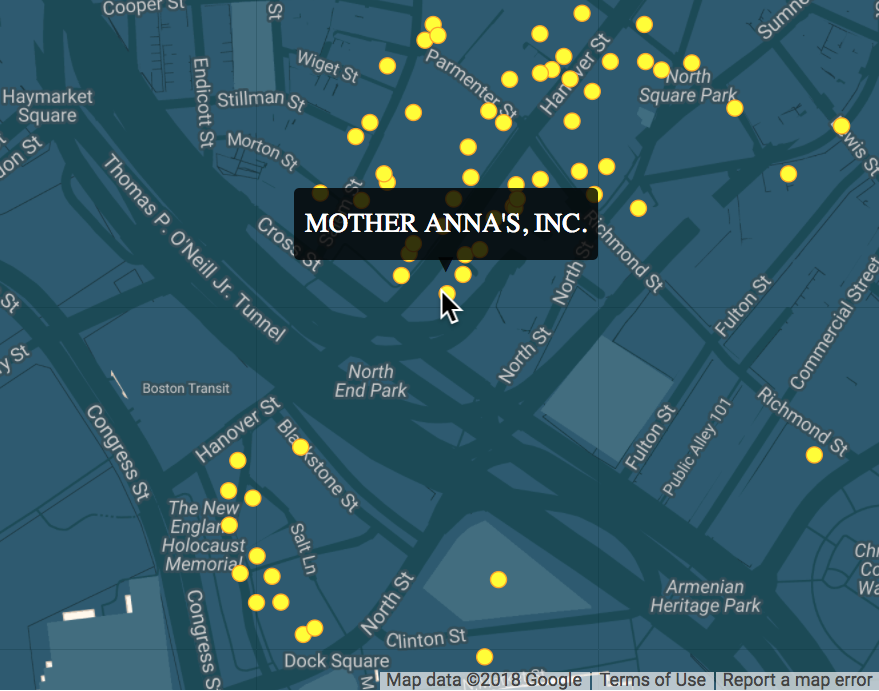

# Process Book

### Overview and Motiviation

Our team set out to create a website visualization of the approved Boston, MA liquor venues with augmented data (namely, Twitter data feed). We discovered the public Data.Boston.Gov website holds a dataset of 1000+ authorized venues with liquor licenses. Our project aimed to present an exploratory view of all approved Boston liquor venues that would show basic information, as well as a Twitter feed that will show tweets related to the specified bar or store across a certain time range.

We believe that showing an exploratory dataset view of venues that sell something engineers are all attracted to (namely, alcohol) provides an opportunity for the end-user to gather more details on the venues they may be interested in visiting. Our project may even provide insights that have not been seen before. For example, a specific bar showing a large amount of related geo-tagged tweets on a given Friday night could indicate that the bar is very popular on that given night.

### Related Work

CS 573 Project - Hashtag Trends (https://github.com/cdeng/HashtagTrends).

We were inspired to show a map visualization of the Boston liquor venues based on the fact that the dataset contained long,lat coordinates. But the above CS 573 project visualization also inspired us to consider social media retrieved content, Twitter for our case.

### Questions

- Q1: What is the most popular bar on a Friday night at midnight, based on tweet content?
- Q2: Which bars/shops are the best/worst based on twitter sentiment?
- Other questions can come from the end-user, thanks to the exploratory view.

### Data

One of the primary datasets that we used is the publicly available liquor licenses .CSV file located at (https://data.boston.gov/dataset/liquor-licenses). This is a legacy dataset, updated as of June 2016, of approximately 1000 listed venues that have been approved for on premises alcohol consumption; licenses issued by the City of Boston Licensing Board and approved by the Massachusetts Alcohol Beverage Control Commission. Within said dataset, some of the important details that we will be taking into consideration are: venue name, street address, license category, and capacity.

The following are descriptions of the Liquor Licenses variables:
- LICENSENO - Liquor license number.
- BUSINESSNAME - Name of business being issued a license (Note: this value does not always line up with name of the establishment or venue.)
- DBANAME - ‘Doing Business As’ name. This value corresponds with the name of the establishment or venue.
- COMMENTS - Comments about the license itself and conditions under which alcohol will be served.
- LOCATIONCOMMENTS - Description of the facility in which alcohol will be served.
- ISSDTTM - Issue date and time of the license.
- EXPDTTM - Expiration date and time of the license.
- LICSTATUS - License status.
- LICCAT - License category.
- LICCATDESC - License category description.
- OPENING - Open time.
- CLOSING - Closing time.
- PATRONSOUT - Time patrons must be off the premises by.
- CAPACITY - Capacity of the facility serving alcohol.
- PRIMAPPLICANT - The ‘primary applicant’ for the license.
- PHONE - Phone number of applicant.
- STNO - The street number associated with a license.
- STNOHI - If the provided address is part of a range this is the highest number within that range.
- Address - The street associated with a license.
- CITY - The city or neighborhood associated with the liquor license.
- STATE - State associated with the liquor license.
- ZIP - Zip code associated with liquor license.
- Location - X,Y coordinates of facility serving alcohol.

The next important dataset we used was Twitter; to be more precise, we have a Twitter feed of all retrieved tweets whose geographic coordinates match with the coordinates of the selected alcohol-serving establishment. It is very possible to have a more accurate retrieval process of tweets-to-venue via a textual tweet content analysis, but this would involve complicated tokenizing and string parsing, which was a little out of our scope due to project time schedule.

During the planning phase, we also considered further using Google Maps and its API features to get more details such as the website, hours, and review score. Unfortunately, we did not have the time to implement this feature. Maybe this is something we will consider on a project update.

Regarding data processing:
The liquor license table will require some data clean up. The table includes the establishment’s location in longitude and latitude, however for some this is set to default numbers of (0,0). We plan to use the Google Maps API to translate street addresses to locations for the map. We then plan to pull twitter data using a geographical filter. This will allow us to get tweets in the vicinity of the establishment. We can then use the tweet data to get the sentiment and popularity of the the establishment. We also plan to use the Google Maps API to collect general information about the establishment. This includes website, price, reviews and pictures.

### Exploratory Data Analysis

One of our first immediate steps was to show all alcohol-approved venues on a map of the city of Boston. From simply viewing all of our data, we could clearly see the great abundance of bars/venues within downtown Boston, such as North End, Financial District, Back Bay, and so forth. This was expected, and the team planned on implementing a Voronoi-based "nearby-venue" selection system; however due to the overlap of some of the venues, this did not seam feasible. We opted to keep all plotted venues. In a future update, we could have a "neighborhood" area selection, where one could click a neighborhood area region, the map would zoom in on that area, and then the venues would be easily viewable and clickable.

### Design Evolution

We first drafted our prototype designs on scratchpad paper:

Then came the design and code implementation for the map of Boston. We used a combination of Google Maps API for the actual geographical map of Boston, and SVG elements for the circles of the venues. We chose the blue-and-black color style borrwed from [Snazzy Maps](https://snazzymaps.com/style/13/neutral-blue). We believed this was not only appealing to the human-perspective, but also a great background to our contrasting yellow circles that represent the alcohol venues. Our map vis went through a couple of iterations:

### Implementation

One important aspect of our final project visualization that we definitely focused on was interactivity. Not only did we allow one to drag-and-zoom on the map of Boston (since it is just like a regular Google Maps embed), but we also implemented a 'click-toggle' on the map, which allows the user to then mouse-over a venue and see a tooltip popup showing the venue's name:

The Twitter dataset was retrieved at a certain time, thus retrieving the latest tweets within a one kilometer radius (0.62 miles) for the locations. The max number of tweets retrieved for a location was set to 50 in order to cut down on runtime as the Twitter API has a rate limit. Once this limit is exceeded, it takes about 15 minutes to reset. While there is no known work around for waiting for this reset time, it was possible to have the program sleep while this time passed. This wait time caused the total runtime to collect the tweets for all 1109 locations to be about 8 hours.

### Evaluation

Unfortunately, we were not able to explicitly answer any of our preliminary questions. However, we that this still serves as a baseline visualization and shows the potential that a connecting alcohol venues and Twitter anecdotal data.

Other revisions to consider for future updates include implementing the sentiment analysis feature and more details retrieved from Google Maps API (such as open-hours and review score rating).

### References

- Boston Neighborhoods map: https://github.com/maptimeBoston/d3-maptime/blob/gh-pages/example6/neighborhoods.js
- D3 Map drag-and-zoom: https://bl.ocks.org/iamkevinv/0a24e9126cd2fa6b283c6f2d774b69a2
- D3 Streamgraph: https://bl.ocks.org/mbostock/4060954
- D3 Interactive Streamgraph: http://bl.ocks.org/WillTurman/4631136
- Twitter Streamgraph: http://ouzor.github.io/blog/2015/08/31/twitter-streamgraph.html
- Twitter Analysis with R: http://www.rdatamining.com/docs/twitter-analysis-with-r
- VR Datavis for Smartphone: https://github.com/davidrs/vr-dataviz/tree/master/2d-map
- Neutral Blue map css style: https://snazzymaps.com/style/13/neutral-blue
- Getting Tweets based on a location: https://github.com/ideoforms/python-twitter-examples/blob/master/twitter-search-geo.py
 - Waiting for Rate Limit to reset: https://stackoverflow.com/questions/41859308/tweepy-twitter-api-rate-limit-exceeded?rq=1

