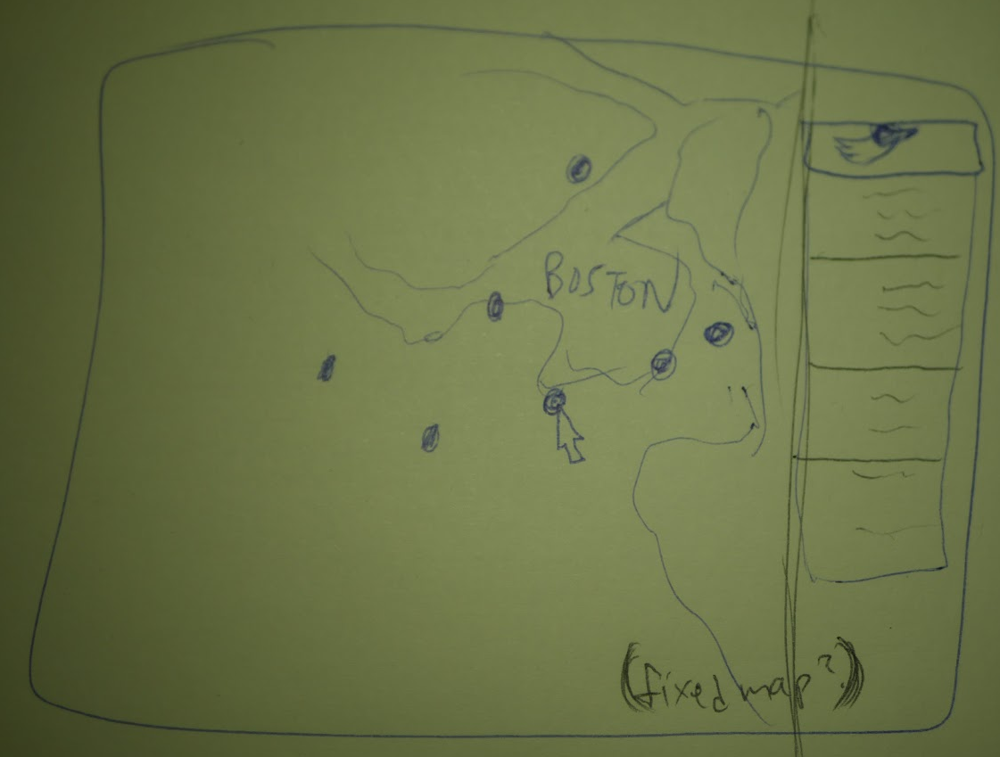
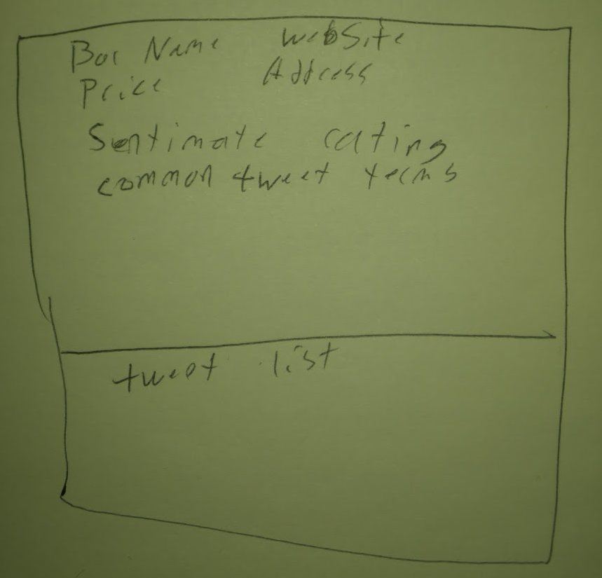
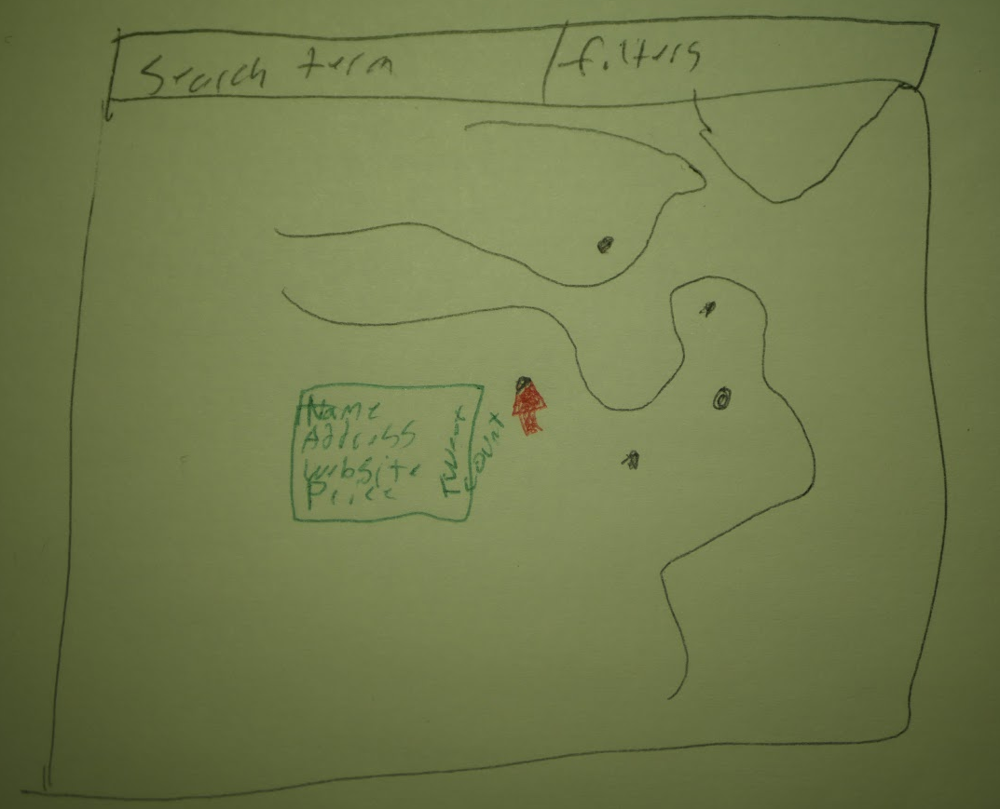

# Signal Search of Boston Liquor Venues

Repo link: https://github.com/akshoop/DataVisFinal

The Team
---
- Alexander Shoop (akshoop@wpi.edu, @akshoop)
- Corey Dixon (cdixon@wpi.edu, @Zimhey)
- Laurie Mazza (lmazza@wpi.edu, @lululazza)

## Background & Motivation
A lot of us computer science students love to go out to Boston, and one particularly fun and engaging activity is consuming alcohol (in moderation!). So, our team wanted to see if there were datasets that focus on restaurants, bars, and stores which sell alcohol. We discovered that the public Data.Boston.Gov website holds a dataset of 1000+ authorized venues with liquor licenses. Our project aims to present an exploratory view of all approved Boston liquor venues that would show basic information, as well as a Twitter feed that will show tweets related to the specified bar or store across a certain time range.

## Objectives
As mentioned, our intention is to provide an exploratory view rather than a visualization that tells an immediate story. In other words, one question we hope to answer is, “what is the most popular bar on a Friday night at midnight, based on tweet count?” Another practical question to answer would be, “which bars/shops are the best/worst based on twitter sentiment?” Since we will be creating an exploratory visualization with interactivity, it is also possible for the end-user to come up with questions on their own.

## The Data
One of the primary datasets that we will be using is the publicly available liquor licenses .CSV file located at (https://data.boston.gov/dataset/liquor-licenses). This is a legacy dataset, updated as of June 2016, of approximately 1000 listed venues that have been approved for on premises alcohol consumption; licenses issued by the City of Boston Licensing Board and approved by the Massachusetts Alcohol Beverage Control Commission. Within said dataset, some of the important details that we will be taking into consideration are: venue name, street address, license category, and capacity.
The next important dataset will be Twitter; to be more precise, we will have a Twitter feed of all retrieved tweets whose geographic coordinates match with the coordinates of the selected alcohol-serving establishment. It is very possible to have a more accurate retrieval process of tweets-to-venue via a textual tweet content analysis, but this would involve complicated tokenizing and string parsing, which we believe may be a little out of our scope.
Lastly, the other dataset we will be using is Google Maps for its API features in order to get accurate longitude-latitude coordinates of the venues as well as business hours and average cost.

## Data Processing
The liquor license table will require some data clean up. The table includes the establishment’s location in longitude and latitude, however for some this is set to default numbers of (0,0). We plan to use the Google Maps API to translate street addresses to locations for the map. We then plan to pull twitter data using a geographical filter. This will allow us to get tweets in the vicinity of the establishment. We can then use the tweet data to get the sentiment and popularity of the the establishment. We also plan to use the Google Maps API to collect general information about the establishment. This includes website, price, reviews and pictures. 

## Visualization Design
We plan to have a map to show the location of each establishment. Users can click the establishment to populate a sidebar with information about the establishment. This data can include name, address, website, price, sentiment, popular tags, reviews, pictures, popularity (tweet count) and a list of tweets associated with the location. 

## Must-Have Features
- A map of Boston where there will be selectable dots/circles of each alcohol venue.
- A tooltip/context menu that shows more details of the chosen venue (address, website, average cost, etc.)
- A Twitter feed that is able to get tweets matching the geographic coordinates of the chosen venue. Tweets should show text content and profile picture of tweet-author.

## Optional Features
- Tooltip/context menu will show average Twitter sentiment of chosen venue. For eg, the tooltip could show a green smiley face if the Twitter sentiment analysis returned positive for the venue.
- Profile pictures in Twitter feed aren’t necessary if they’re difficult to show.

## Project Schedule

### Week 1:
- Get Twitter API and Google Maps API keys
- Clean up liquor licenses data (Correct Geographical location using Google Maps API)
- Basic Visualization 
	* Show Map
	* Display Locations as Points
	* Sidebar displaying establishment information on selection
	* List of establishments
- Pull additional establishment information from Google Maps API (add to sidebar)

### Week 2:
- Pull tweets based on geographical information
- Analyze tweets
	* Sentiment
	* Popularity
	* More (TBD)
- Update sidebar to display analysis
- Provide search functionality
- Sort list by twitter data
	* Sentiment
	* Popularity
	* More (TBD)
- Create presentation and video

## Sketches

Create a proposal document addressing the following points.
Use the points as headers in your document.

- Basic Info. The project title, your names, e-mail addresses, GitHub ids, a link to the project repository (I encourage you to transfer your work to a public repo after the course).
- Background and Motivation. Discuss your motivations and reasons for choosing this project, especially any background or research interests that may have influenced your decision.
- Project Objectives. Provide the primary questions you are trying to answer with your visualization. What would you like to learn and accomplish? List the benefits.
- Data. From where and how are you collecting your data? If appropriate, provide a link to your data sources.
- Data Processing. Do you expect to do substantial data cleanup? What quantities do you plan to derive from your data? How will data processing be implemented?
- Visualization Design. How will you display your data? Provide some general ideas that you have for the visualization design. Develop three alternative prototype designs for your visualization. Create one final design that incorporates the best of your three designs. Describe your designs and justify your choices of visual encodings. We recommend you use the [Five Design Sheet Methodology](http://fds.design/).
- Must-Have Features. List the features without which you would consider your project to be a failure.
- Optional Features. List the features which you consider to be nice to have, but not critical.
- Project Schedule. Make sure that you plan your work so that you can avoid a big rush right before the final project deadline, and delegate different modules and responsibilities among your team members. Write this in terms of weekly deadlines.
    - Each team member must push this document into his/her homework directory. As a ballpark number: your proposal should contain about 3-4 pages of text, plus 5-6 pages of sketches.
